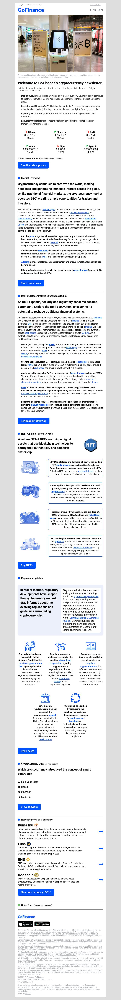

# GoFinance-Newsletter-Email
Custom hand-coded HTML inline CSS newsletter Email. 
Custom unbranded created all content, layout, logo, and idea.  
Photo by <a href="https://unsplash.com/de/@generalbytes?utm_content=creditCopyText&utm_medium=referral&utm_source=unsplash">GENERAL BYTES</a> on <a href="https://unsplash.com/de/fotos/ein-display-in-einem-geschaft-mit-einem-bitcoin-automaten-davor-n0TeMHrPJ38?utm_content=creditCopyText&utm_medium=referral&utm_source=unsplash">Unsplash</a>

- Live Site URL: [Add live site URL here](https://ryoshi1001.github.io/GoFinance-Newsletter-Email/)

Built with:
- HTML5 
- CSS Inline / Custom properties
- Responsive-Design
- Ghost Tables
  
The designs were created to the following widths:
- Max-width: 600px
- 
## Colors
Blue: #0052ff
Black: #0a0b0e, #000000
Gray: #a4a8af, #a4a8af

## Typography
- Family: [Roboto]([https://fonts.google.com/specimen/Be+Vietnam+Pro](https://fonts.google.com/specimen/Roboto))
